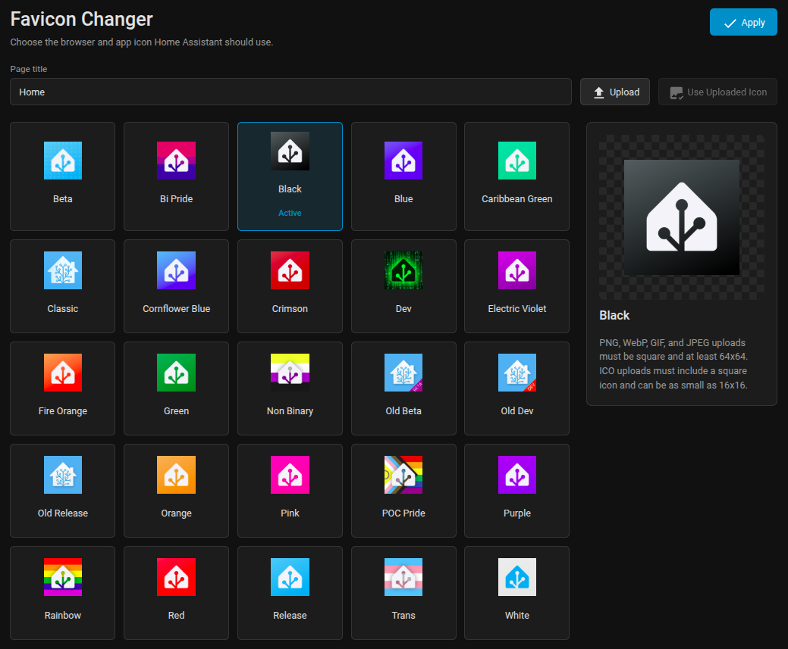

# Home Assistant Favicon Changer

[![HACS][badge-hacs]][link-hacs]
[![GitHub Release][badge-release]][link-release]
[![GitHub Commit Activity][badge-commit-activity]][link-commits]
[![HACS Validation][badge-hacs-validation]][link-hacs-validation]
[![Hassfest][badge-hassfest]][link-hassfest]

Custom Home Assistant integration to change the browser title, favicon, and web app icons.

This repository is a maintained fork of an older integration that was no longer updated.

## What It Does

- Sets a custom page title for Home Assistant.
- Replaces browser and web app icons.
- Provides built-in icon presets (auto-discovered from the integration `presets/` folder).
- Adds a Home Assistant sidebar panel for previewing and applying presets.
- Supports uploading one custom icon from the panel.
- Automatically keeps only the active preset in `/config/www/favicon-presets` to avoid clutter.

## Installation

### Method 1 (Recommended): HACS Custom Repository

1. Open HACS in Home Assistant.
2. Go to `Integrations`.
3. Open the menu and choose `Custom repositories`.
4. Add this repository URL:
   - `https://github.com/chiconws/ha-favicon-changer`
5. Set category to `Integration`.
6. Install `ha-favicon-changer` from HACS.
7. Restart Home Assistant.

### Method 2: Manual Installation

1. Copy `custom_components/ha-favicon-changer/` to:
   - `<config>/custom_components/ha-favicon-changer/`
2. Restart Home Assistant.

## Configuration (UI)

1. Go to `Settings -> Devices & Services -> Integrations`.
2. Add `Favicon Changer`.
3. Set:
   - `Page title` (optional)
   - `Icon preset`
4. Save and refresh your browser.

## Favicon Panel

After setup, open `Favicon Changer` from the Home Assistant sidebar.



- Select a preset to preview it before applying.
- Upload a custom icon and preview it before applying.
- Custom uploads accept square PNG, ICO, WebP, GIF, or JPEG files up to 1 MiB.
- PNG, WebP, GIF, and JPEG uploads must be at least 64x64 and no larger than 1024x1024.
- ICO uploads must include a square icon at least 16x16.

## Notes

- Browser favicon caching can be aggressive. If the icon does not update immediately, do a hard refresh.
- If title/icon behavior looks stale, apply the current selection again from the panel.

## Troubleshooting

Add debug logging in `configuration.yaml`:

```yaml
logger:
  logs:
    custom_components.ha-favicon-changer: debug
```

Then restart and check logs.

## License

MIT (see `LICENSE`).

## Original Creator

Original integration created by **Thomas Lovén**:
<https://github.com/thomasloven/hass-favicon>

[badge-hacs]: https://img.shields.io/badge/HACS-Custom-41BDF5.svg
[badge-release]: https://img.shields.io/badge/dynamic/json?url=https%3A%2F%2Fapi.github.com%2Frepos%2Fchiconws%2Fha-favicon-changer%2Freleases%2Flatest&query=%24.tag_name&label=release
[badge-commit-activity]: https://img.shields.io/github/commit-activity/m/chiconws/ha-favicon-changer
[badge-hacs-validation]: https://github.com/chiconws/ha-favicon-changer/actions/workflows/hacs.yaml/badge.svg
[badge-hassfest]: https://github.com/chiconws/ha-favicon-changer/actions/workflows/hassfest.yaml/badge.svg

[link-hacs]: https://hacs.xyz/
[link-release]: https://github.com/chiconws/ha-favicon-changer/releases/latest
[link-commits]: https://github.com/chiconws/ha-favicon-changer/commits/main
[link-hacs-validation]: https://github.com/chiconws/ha-favicon-changer/actions/workflows/hacs.yaml
[link-hassfest]: https://github.com/chiconws/ha-favicon-changer/actions/workflows/hassfest.yaml
